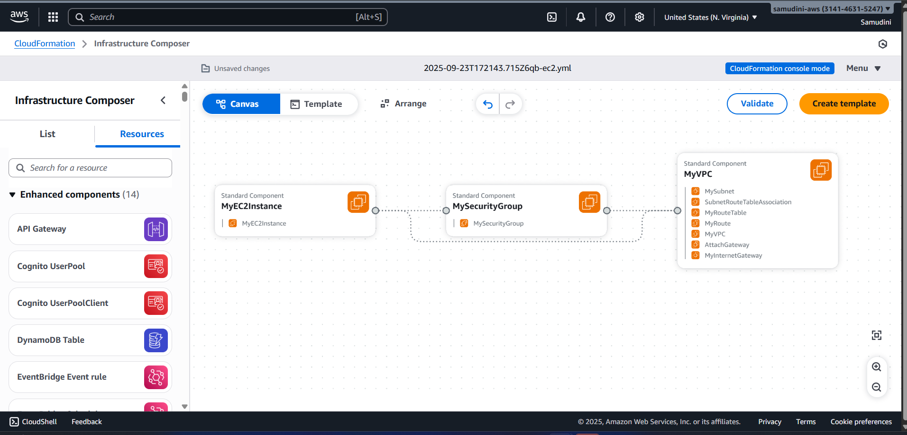
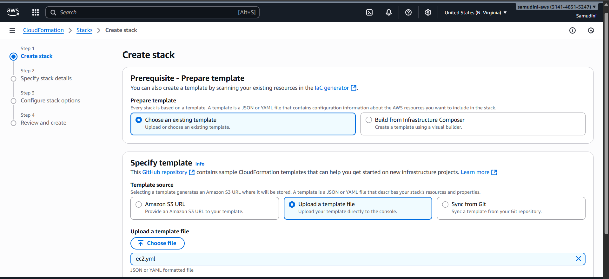
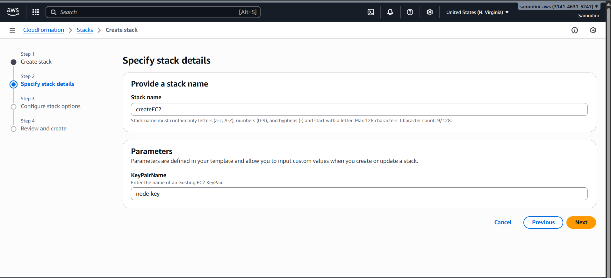
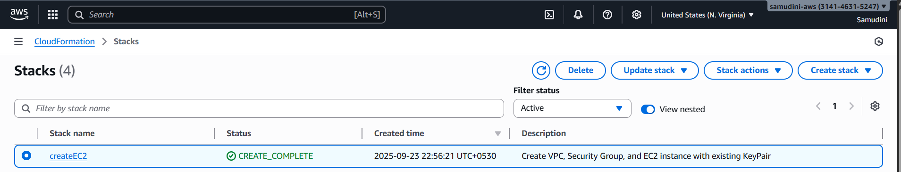
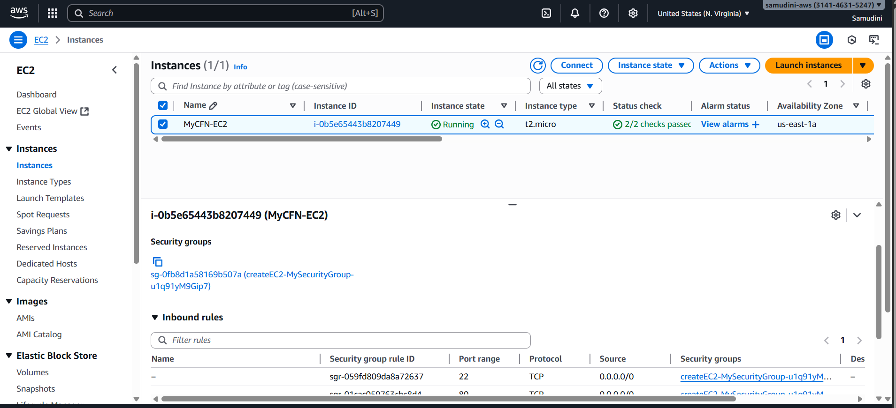
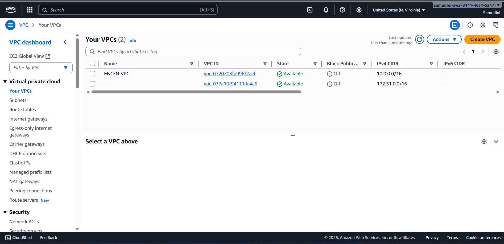

# AWS CloudFormation Practical – Creating EC2 with VPC, Security Groups

## 1. Objective
The purpose of this practical is to use **AWS CloudFormation** to automate the provisioning of infrastructure. The stack will create:

- A **VPC** with public subnet  
- An **Internet Gateway** and routing to the internet  
- A **Security Group** allowing SSH and HTTP  
- An **EC2 instance** launched inside the VPC using an existing key pair  

---

## 2. Pre-requisites
Before starting, ensure:

- You have access to an **AWS Account**.  
- An existing **EC2 Key Pair** is available (for SSH login). Example: `node-key`.  
- You are working in a **supported region** (here: `us-east-1`).  
- Basic familiarity with **CloudFormation Console** or **AWS CLI**.  

---

## 3. Architecture Diagram
The following diagram illustrates the architecture deployed:  

  

**Components:**
- `VPC (10.0.0.0/16)`  
- `Subnet (10.0.1.0/24)` in one Availability Zone  
- `Internet Gateway` attached to VPC  
- `Route Table` with route `0.0.0.0/0 → IGW`  
- `Security Group` with rules:  
  - Allow **SSH (22)** from anywhere  
  - Allow **HTTP (80)** from anywhere  
- `EC2 Instance (t2.micro)` launched in subnet  

---

## 4. CloudFormation YAML Template

```yaml
Description: "Create VPC, Security Group, and EC2 instance with existing KeyPair"

Parameters:
  KeyPairName:
    Description: Enter the name of an existing EC2 KeyPair
    Type: String
    Default: node-key   # your existing key pair

Resources:
  # VPC
  MyVPC:
    Type: AWS::EC2::VPC
    Properties:
      CidrBlock: 10.0.0.0/16
      EnableDnsSupport: true
      EnableDnsHostnames: true
      Tags:
        - Key: Name
          Value: MyCFN-VPC

  # Internet Gateway
  MyInternetGateway:
    Type: AWS::EC2::InternetGateway

  # Attach IGW to VPC
  AttachGateway:
    Type: AWS::EC2::VPCGatewayAttachment
    Properties:
      VpcId: !Ref MyVPC
      InternetGatewayId: !Ref MyInternetGateway

  # Public Subnet
  MySubnet:
    Type: AWS::EC2::Subnet
    Properties:
      VpcId: !Ref MyVPC
      CidrBlock: 10.0.1.0/24
      MapPublicIpOnLaunch: true
      AvailabilityZone: !Select [ 0, !GetAZs "" ]
      Tags:
        - Key: Name
          Value: MyCFN-Subnet

  # Route Table
  MyRouteTable:
    Type: AWS::EC2::RouteTable
    Properties:
      VpcId: !Ref MyVPC

  # Route to Internet
  MyRoute:
    Type: AWS::EC2::Route
    DependsOn: AttachGateway
    Properties:
      RouteTableId: !Ref MyRouteTable
      DestinationCidrBlock: 0.0.0.0/0
      GatewayId: !Ref MyInternetGateway

  # Associate Subnet with Route Table
  SubnetRouteTableAssociation:
    Type: AWS::EC2::SubnetRouteTableAssociation
    Properties:
      SubnetId: !Ref MySubnet
      RouteTableId: !Ref MyRouteTable

  # Security Group
  MySecurityGroup:
    Type: AWS::EC2::SecurityGroup
    Properties:
      GroupDescription: Allow SSH and HTTP access
      VpcId: !Ref MyVPC
      SecurityGroupIngress:
        - IpProtocol: tcp
          FromPort: 22
          ToPort: 22
          CidrIp: 0.0.0.0/0
        - IpProtocol: tcp
          FromPort: 80
          ToPort: 80
          CidrIp: 0.0.0.0/0
      Tags:
        - Key: Name
          Value: MyCFN-SG

  # EC2 Instance
  MyEC2Instance:
    Type: AWS::EC2::Instance
    Properties:
      InstanceType: t2.micro
      ImageId: ami-0c02fb55956c7d316   # Amazon Linux 2 AMI (us-east-1)
      KeyName: !Ref KeyPairName        # using existing key pair
      SubnetId: !Ref MySubnet
      SecurityGroupIds:
        - !Ref MySecurityGroup
      Tags:
        - Key: Name
          Value: MyCFN-EC2

Outputs:
  VPCId:
    Description: VPC ID
    Value: !Ref MyVPC

  InstanceId:
    Description: EC2 Instance ID
    Value: !Ref MyEC2Instance

  PublicIP:
    Description: Public IP of EC2
    Value: !GetAtt MyEC2Instance.PublicIp
```
# 5. Steps to Deploy
## Step 1: Open CloudFormation Console & Upload Template 
- Navigate to AWS CloudFormation → Create Stack → With new resources (standard). 
- Choose Upload a template file
- Upload the YAML file created above.
-   

## Step 2: Configure Stack Details
- Enter a Stack Name (e.g., EC2-VPC-Stack).
- Enter KeyPairName (e.g., node-key).
- -  

## Step 3: Review and Create Stack
- Leave other options as default. (beginner friendly)
- Check IAM resource acknowledgment.
- Click Create stack.
- -  

#  6. Verification

- Once the stack is created successfully, verify resources:

## EC2 Instance
-  

## VPC & Subnet
-  

## Security Group
-  

## CloudFormation Stack Outputs
-  


# 7. Testing

- Copy the Public IP of the EC2 instance.
- SSH into instance using existing key pair:

``` ssh -i node-key.pem ec2-user@<PublicIP> ```


- If HTTP port is open, install and test a web server:

```
sudo yum install -y httpd
sudo systemctl start httpd
echo "Hello from CloudFormation EC2" | sudo tee /var/www/html/index.html
```


# Then visit:

``` http://<PublicIP>```

# 8. Conclusion

- In this practical, we automated the creation of a complete AWS environment using CloudFormation. The template successfully provisioned:

- A VPC with networking components
- A Security Group with SSH & HTTP access
- An EC2 instance deployed inside the subnet

- This demonstrates the Infrastructure as Code (IaC) principle, making infrastructure reproducible, scalable, and easier to manage.
